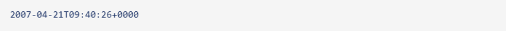
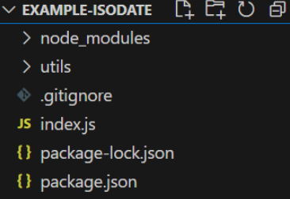
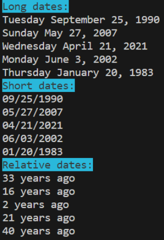
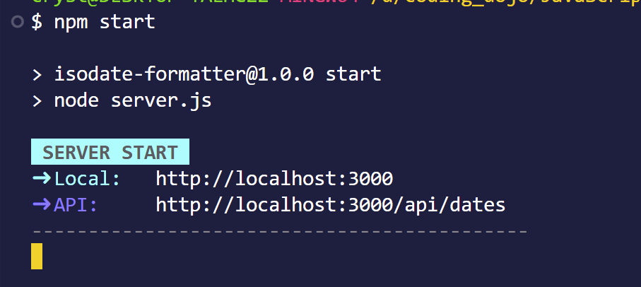
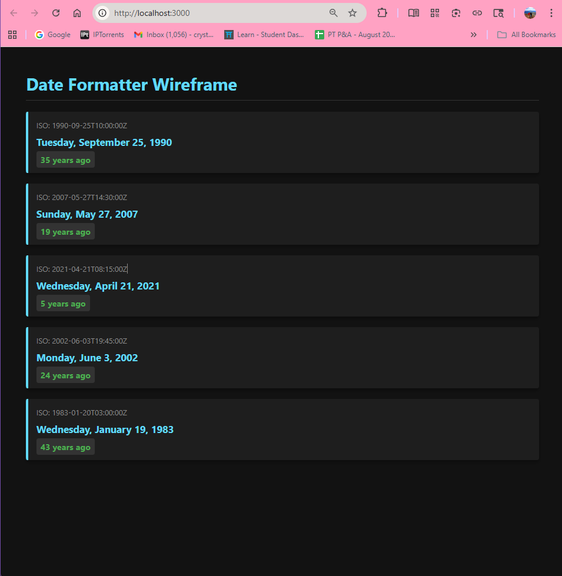
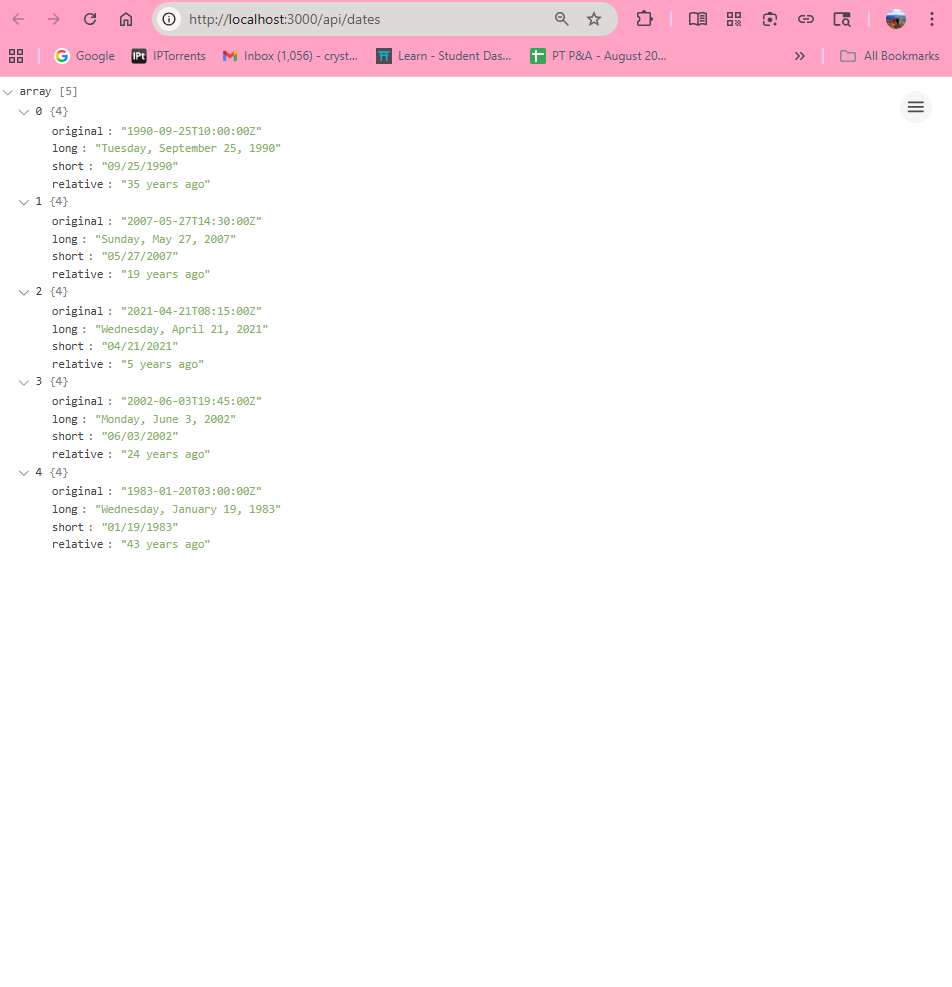

# ISODate-Formatter

 Example

##### Difficulty Level: Advanced | Est. Time: 00:00-03:00

##### Learning how to format dates will help us even outside of JavaScript development!

### Learning Objectives

- Explain how the ISO 8601 date format applies to dates in computing
- Apply **`Day.js`** to manipulate dates and render them as console messages
- Practice **installing node modules** and updating **`package.json`**

#

### Node Dates

As projects grow larger in scale, it becomes increasingly important to separate code into distinct responsibilities, ultimately making our code more maintainable. For this assignment, we are going to create a utility that helps us format dates using a modularized folder structure.

When computers create and save dates, they use the International Organization for Standardization (ISO) date format. This helps all kinds of systems save dates in ways that are typically very easy for computers to work with. This is also the format we will be using with MongoDB. Let's take a look:

Great for computers, but not so great for users. Luckily for us, we have a node module that can help us format these ISO 8601 date formats into clean human-readable strings. That module is **`Day.js`**. You can find the documentation for it [**`here`**](https://day.js.org/).

Our goal is to create an `index.js` file to generate ISO dates and log them as strings to the console. Next, we will make a `formatDate.js` utility to define the different types of data manipulation. We will then connect them with Import and Export. Here is an example folder:

And when running `node index.js`, the output should look something like this:

**Hint**: if you want your console to log in a cool color, consider adding in the node module Chalk [**`here`**](https://github.com/chalk/chalk)!

#

- [ ] Create a new project called isodate-formatter

- [ ] Create an `index.js` file

- [ ] Run `npm init -y`

- [ ] Add "type" field to package.json with value of "module": "type": "module"

- [ ] Run `npm install dayjs`

- [ ] Create new module file `mkdir utils && touch utils/formatDate.js`

- [ ] In `formatDate.js`, import the dayjs module.

- [ ] In `formatDate.js`, create and export a function that takes an ISO date, like `2023-01-01T12:34:56Z`, and returns a readable string as an output (e.g. `January 1, 2023, 12:34:56 PM UTC`).

Have a function for converting date formats to appear like "`4 months ago`"

Have a function for converting date formats to appear like "`Thursday, January 21, 2023`"

- [ ] Have a function for converting date formats to appear like "`01/21/2023`"

- [ ] Test each string format with at least five different dates

- [ ] In `index.js`, import your functions, run them, and log their outputs to the console

- [ ] **Bonus**: Log your output with different colors by installing chalk `npm install chalk`

#

